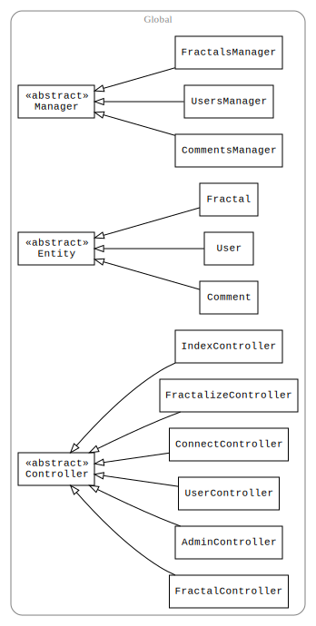

# Fractalizer
Créez et partagez des fractales avec vos amis !

Fractalizer permet de créer des fractales utilisant la grammaire des [L-Systèmes](http://fr.wikipedia.org/wiki/L-Syst%C3%A8me).
Un visiteur peut voir un affichage de toutes les fractales du site sur la page principale, classées par vote ou par date d’ajout.
Il peut également voir une page spécifique par fractale sur laquelle sont affichés des commentaires laissés par les utilisateurs.
Chaque utilisateur a également une page personnelle sur laquelle sont affichées les fractales qu’il a posté,
et des aperçus des fractales qu’il a commenté et voté.
Une fois inscrit, le visiteur peut poster, commenter et voter une fractale.

Le code source du site est sur Github: [MisterDA/Fractalizer](https://github.com/MisterDA/Fractalizer),
et également en ligne [fractalizer.alwaysdata.net](http://fractalizer.alwaysdata.net/) mais nous avons rencontré des soucis d’intégration avec le serveur.

## Sitemap
    /                           Fractales classées par votes
    /new                        Nouvelles fractales
    /connect                    Connexion / Inscription
    /fractalize                 Créer une fractale
    /user?id=%userid%           Page d’un utilisateur
    /fractal?id=%fractalid%     Page d’une fractale

## Contenu de l’archive
```
.
├── controller
│   ├── AdminController.php
│   ├── ConnectController.php
│   ├── Controller.php
│   ├── FractalController.php
│   ├── FractalizeController.php
│   ├── IndexController.php
│   └── UserController.php
├── db
│   ├── db_connect.php
│   ├── db_info-example.php
│   ├── db_info.php
│   └── db_populate.php
├── index.php
├── LICENSE
├── model
│   ├── Comment.php
│   ├── CommentsManager.php
│   ├── Entity.php
│   ├── Fractal.php
│   ├── FractalsManager.php
│   ├── Manager.php
│   ├── User.php
│   └── UsersManager.php
├── README.md
└── view
    ├── assets
    │   ├── css
    │   │   ├── admin.css
    │   │   ├── connect.css
    │   │   ├── fractal.css
    │   │   ├── fractalize.css
    │   │   ├── index.css
    │   │   ├── menu.css
    │   │   └── user.css
    │   ├── img
    │   │   └── wall.jpg
    │   └── js
    │       ├── admin.js
    │       ├── connect.js
    │       ├── fractalize.js
    │       ├── fractal.js
    │       ├── index.js
    │       ├── l-system.js
    │       └── user.js
    ├── include
    │   ├── admin
    │   │   ├── comments.php
    │   │   ├── fractals.php
    │   │   └── users.php
    │   ├── fractal.php
    │   └── menu.php
    └── pages
        ├── admin.php
        ├── connect.php
        ├── fractalize.php
        ├── fractal.php
        ├── index.php
        └── user.php
```


## Installation
Renommer `db/db_info-example.php` to `db/db_info.php` et le remplir avec les informations de connexion au serveur MongoDB.
Requiert PHP 5.6, MongoDB et Apache ModRewrite activé.

## Architecture du code
Le site suit le design pattern [Modèle-Vue-Contrôleur](http://fr.wikipedia.org/wiki/Mod%C3%A8le-vue-contr%C3%B4leur).
Grâce au ModRewrite d’Apache dans le fichier `.htaccess`, tout le trafic du site est redirigé vers le fichier `index.php`.
`index.php` appelle ensuite le contrôleur adéquat situé dans le dossier `controller`.
Le contrôleur analyse la requête, et utilise les classes du modèle dans `model` pour toutes les opérations
[CRUD](http://fr.wikipedia.org/wiki/CRUD) (classes `*Manager`) affectant les entités (`User`, `Fractal` et `Comment`).
Une fois que les requêtes vers la base de donnée ont été effectuées, le contrôleur passe la main à la vue (`view`),
qui fonctionne comme un moteur de templates, et ajoute aussi les fichiers css et js.

Un autre point important est que les documents MongoDB (array PHP natifs) ne sont jamais manipulés directement,
mais transformés en objets grâce à des classes attitrées (voir dans `model`).

La documentation dans le dossier `doc` propose un résumé de toutes les classes et fonctions utilisées.



## Organisation du serveur
Antonin a fait le back-end et Pablo le front-end.

## Quelques éléments importants du code
### Hydratation / Déhydratation
Etant donné que les arrays MongoDB sont indexés par des strings comme par exemple `name`,
on peut lors de la construction d’un objet `User` utiliser ceci: si l’on définit dans la classe les mutateurs
avec la convention `function setName()`, alors il suffit de mettre la première lettre de l’index
en majuscule en la faisant précéder de `set`, et d’utiliser le mécanisme de résolution de lien vers les fonctions
de PHP si l’on a le nom de la fonction stocké dans une string.
On peut donc transformer un document en objet (hydrater) comme ceci:
```php
/**
 * Hydrate an User from MongoDB document
 * @param array $document Document to create the user from
 */
public function hydrate(array $document) {
    foreach ($document as $key => $value) {
        $method = 'set'.ucfirst($key);
        if (method_exists($this, $method)) {
            $this->$method($value);
        }
    }
}
```
Et à l’inverse, si l’on veut transformer un objet en array (déhydrater):
```php
/**
* Create MongoDB document from User
* @return array MogoDB document
*/
public function dehydrate() {
    if ($this->_id != NULL)
        return array("_id" => $this->_id);
    return array();
}
```

### Dessin des fractales
Les fractales sont dessinés dans l’élément HTML5 canvas.
Les fonctions de dessins sont situées dans le fichier `view/assets/js/l-system.js`.
L’interface est très simple, l’utilisateur de manipule qu’un objet Curve demandant la formule de la fractale, et le canvas.
En interne, une représentation de dessin en tortue est utilisée.
La formule de la fractale est un objet JSON, voici un exemple pour le [Flocon de Koch](http://fr.wikipedia.org/wiki/Flocon_de_Koch):
```
{
    "alphabet": ["F"],
    "constants": ["+", "-"],
    "angle": 90,
    "iter": 4,
    "axiom": "F",
    "rules": {
        "F": "F+F-F-F+F"
    }
}
```
La syntaxe est claire, mais pourrait être étendue pour supporter d’autres types de grammaires et plus d’options de dessin.

